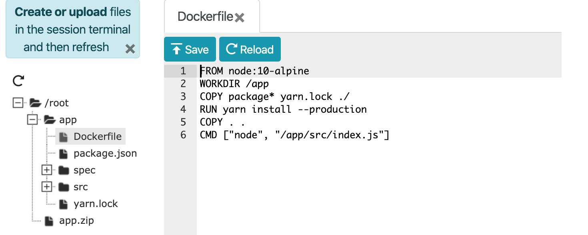

## Criando Arquivos

Se você é novo no terminal Linux, não se preocupe! O jeito mais fácil de criar um arquivo é utilizando o
comando `touch`.

```bash
touch Dockerfile
```

Se você rodar `ls`, você verá que o arquivo foi criado. Uma vez criado, você pode utilizar as dicas **Editando Arquivos** abaixo.

## Editando Arquivos

No PWD, você pode utilizar qualquer editor de texto baseado em CLI. Entretanto, sabemos que muitos não se sentem
confortáveis utilizando o CLI.
Você pode clicar no botão "Editor" para abrir a janela do gerenciador de arquivos.

{: style=width:50% }
{:.text-center}

Depois de clicar no botão editor, o editor de arquivo irá abrir. Selecionando um arquivo fornecerá um editor 
baseado na web.

{: style=width:75% }
{: .text-center }

## Abrindo uma Aplicação quando não tiver o botão

Se você iniciou um contêiner, mas o botão da porta não apareceu, ainda existe um jeito de abrir a aplicação.

1. Primeiro, valide se o contêiner está realmente rodando e apenas não falhou ao iniciar. Rode `docker ps` e
   verifique se a porta está mapeada na seção `PORTS`.

    ```bash
    $ docker ps
    CONTAINER ID        IMAGE               COMMAND                  CREATED             STATUS              PORTS                    NAMES
    976e7066d705        docker-101          "docker-entrypoint.s…"   2 seconds ago       Up 1 second         0.0.0.0:3000->3000/tcp   xenodochial_ritchie
    ```

    Se o contêiner falhou ao iniciar, verifique os logs do contêiner e tente descobrir o que aconteceu.

1. No PWD, procure o painel `SSH`. Ele deve mostrar algo parecido com `ssh ip172...`. Copie tudo DEPOIS da parte
   do `ssh` (`ip172....`).

1. Cole isso no navegador, mas NÃO aperte enter ainda. Procure o símbolo `@`. Substitua por `-PORT`. Por exemplo,
   se eu tivesse `ip172-18-0-22-bmf9t2ds883g009iqq80@direct.labs.play-with-docker.com` e quisesse ver a porta 3000, eu iria
   abrir <code>ip172-18-0-22-bmf9t2ds883g009iqq80<strong>-3000</strong>.direct.labs.play-with-docker.com</code>.