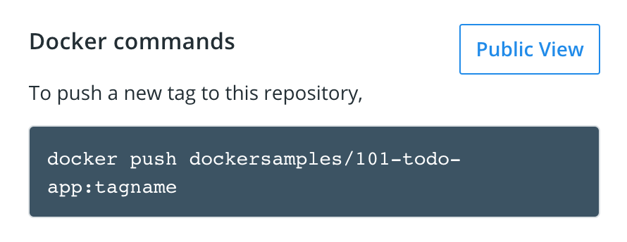

Now that we've built an image, let's share it! To share Docker images, you have to use a Docker
registry. The default registry is Docker Hub and is where all of the images we've used have come from.

## Create a Repo

To push an image, we first need to create a repo on Docker Hub.

1. Go to [Docker Hub](https://hub.docker.com) and log in if you need to.

1. Click the **Create Repository** button.

1. For the repo name, use `101-todo-app`. Make sure the Visibility is `Public`.

1. Click the **Create** button!

If you look on the right-side of the page, you'll see a section named **Docker commands**. This gives
an example command that you will need to run to push to this repo.

{: style=width:75% }
{: .text-center }


## Pushing our Image

1. Back in your PWD instance, try running the command. You should get an error that looks something 
like this:

    ```plaintext
    $ docker push dockersamples/101-todo-app
    The push refers to repository [docker.io/dockersamples/101-todo-app]
    An image does not exist locally with the tag: dockersamples/101-todo-app
    ```

    Why did it fail? The push command was looking for an image named dockersamples/101-todo-app, but
    didn't find one. If you run `docker image ls`, you won't see one either.

    To fix this, we need to "tag" our image, which basically means give it another name.

1. Use the `docker tag` command to give the `docker-101` image a new name. Be sure to swap out
   `YOUR-USER-NAME` with your Docker ID.

    ```bash
    docker tag docker-101 YOUR-USER-NAME/101-todo-app
    ```

1. Now try your push command again. If you're copying the value from Docker Hub, you can drop the 
   `tagname` portion, as we didn't add a tag to the image name.

    ```bash
    docker push YOUR-USER-NAME/101-todo-app
    ```

## Running our Image on a New Instance

Now that our image has been built and pushed into a registry, let's try running our app on a brand
instance that has never seen this container!

1. Back in PWD, click on **Add New Instance** to create a new instance.

1. In the new instance, start your freshly pushed app.

    ```bash
    docker run -dp 3000:3000 YOUR-USER-NAME/101-todo-app
    ```

    You should see the image get pulled down and eventually start up!

1. Click on the 3000 badge when it comes up and you should see the app with your modifications! Hooray!


## Recap

In this section, we learned how to share our images by pushing them to a registry. We then went to a
brand new instance and were able to run the freshly pushed image. This is quite common in CI pipelines,
where the pipeline will create the image and push it to a registry and then the production environment
can use the latest version of the image.

Now that we have that figured out, let's circle back around to what we noticed at the end of the last
section. As a reminder, we noticed that when we restarted the app, we lost all of our todo list items.
That's obviously not a great user experience, so let's learn how we can persist the data across 
restarts!